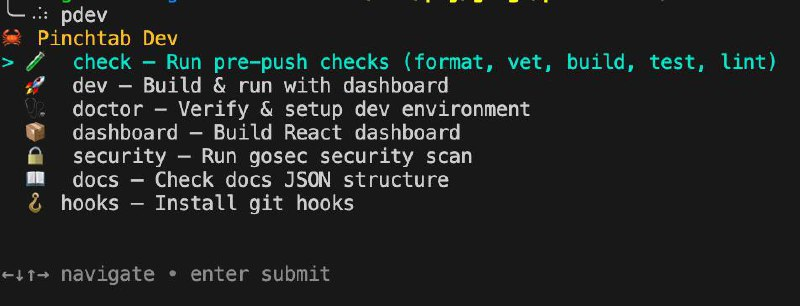

# Contributing

Guide to build PinchTab from source and contribute to the project.

## System Requirements

### Minimum Requirements

| Requirement | Version | Purpose |
|------------|---------|---------|
| Go | 1.25+ | Build language |
| golangci-lint | Latest | Linting (required for pre-commit hooks) |
| Chrome/Chromium | Latest | Browser automation |
| macOS, Linux, or WSL2 | Current | OS support |

### Recommended Setup

- **macOS**: Homebrew for package management
- **Linux**: apt (Debian/Ubuntu) or yum (RHEL/CentOS)
- **WSL2**: Full Linux environment (not WSL1)

---

## Quick Start

**Fastest way to get started:**

```bash
# 1. Clone
git clone https://github.com/pinchtab/pinchtab.git
cd pinchtab

# 2. Run doctor (verifies environment, prompts before installing anything)
./pdev doctor

# 3. Build and run
go build ./cmd/pinchtab
./pinchtab
```

**Example output:**
```
  🦀 Pinchtab Doctor
  Verifying and setting up development environment...

Go Backend
  ✓ Go 1.26.0
  ✗ golangci-lint
    Required for pre-commit hooks and CI.
    Install golangci-lint via brew? [y/N] y
    ✓ golangci-lint installed
  ✓ Git hooks
  ✓ Go dependencies

Dashboard (React/TypeScript)
  ✓ Node.js 22.15.1
  · Bun not found
    Optional — used for fast dashboard builds.
    Install Bun? [y/N] n
    curl -fsSL https://bun.sh/install | bash

Summary

  · 1 warning(s)
```

The doctor asks for confirmation before installing anything.
If you decline, it shows the manual install command instead.

---

## Part 1: Prerequisites

### Install Go

**macOS (Homebrew):**
```bash
brew install go
go version  # Verify: go version go1.25.0
```

**Linux (Ubuntu/Debian):**
```bash
sudo apt update
sudo apt install -y golang-go git build-essential
go version
```

**Linux (RHEL/CentOS):**
```bash
sudo yum install -y golang git
go version
```

**Or download from:** https://go.dev/dl/

### Install golangci-lint (Required)

Required for pre-commit hooks:

**macOS/Linux:**
```bash
brew install golangci-lint
```

**Or via Go:**
```bash
go install github.com/golangci/golangci-lint/cmd/golangci-lint@latest
```

Verify:
```bash
golangci-lint --version
```

### Install Chrome/Chromium

**macOS (Homebrew):**
```bash
brew install chromium
```

**Linux (Ubuntu/Debian):**
```bash
sudo apt install -y chromium-browser
```

**Linux (RHEL/CentOS):**
```bash
sudo yum install -y chromium
```

### Automated Setup

After cloning, run doctor to verify and set up your environment:

```bash
git clone https://github.com/pinchtab/pinchtab.git
cd pinchtab
./pdev doctor
```

Doctor checks your environment and **asks before installing** anything:
- Go 1.25+ and golangci-lint (offers `brew install` or `go install`)
- Git hooks (copies pre-commit hook)
- Go dependencies (`go mod download`)
- Node.js, Bun, and dashboard deps (optional, for dashboard development)

Run `./pdev doctor` anytime to verify or fix your environment.

---

## Part 2: Build the Project

### Simple Build

```bash
go build -o pinchtab ./cmd/pinchtab
```

**What it does:**
- Compiles Go source code
- Produces binary: `./pinchtab`
- Takes ~30-60 seconds

**Verify:**
```bash
ls -la pinchtab
./pinchtab --version
```

---

## Part 3: Run the Server

### Start (Headless)

```bash
./pinchtab
```

**Expected output:**
```
🦀 PINCH! PINCH! port=9867
auth disabled (set BRIDGE_TOKEN to enable)
```

### Start (Headed Mode)

```bash
BRIDGE_HEADLESS=false ./pinchtab
```

Opens Chrome in the foreground.

### Background

```bash
nohup ./pinchtab > pinchtab.log 2>&1 &
tail -f pinchtab.log  # Watch logs
```

---

## Part 4: Quick Test

### Health Check

```bash
curl http://localhost:9867/health
```

### Try CLI

```bash
./pinchtab quick https://example.com
./pinchtab nav https://github.com
./pinchtab snap
```

---

## Development

### Run Tests

```bash
go test ./...                              # All tests
go test ./... -v                           # Verbose
go test ./... -v -coverprofile=coverage.out
go tool cover -html=coverage.out           # View coverage
```

### Developer Toolkit (`pdev`)

All dev scripts are accessible through `./pdev`:

```bash
./pdev              # Interactive picker (uses gum if installed, numbered fallback)
./pdev check        # Run directly by name
./pdev --help       # List all commands
```



**Available commands:**

| Command | Description |
|---------|-------------|
| `check` | Run pre-push checks (format, vet, build, test, lint) |
| `dev` | Build & run with dashboard |
| `doctor` | Verify & setup dev environment |
| `dashboard` | Build React dashboard |
| `security` | Run gosec security scan |
| `docs` | Check docs JSON structure |
| `hooks` | Install git hooks |

For the fancy interactive picker, install [gum](https://github.com/charmbracelet/gum): `brew install gum`

**Tip:** Add this to `~/.zshrc` to use `pdev` without `./`:
```bash
pdev() { if [ -x "./pdev" ]; then ./pdev "$@"; else echo "pdev not found in current directory"; return 1; fi }
```

### Code Quality

```bash
./pdev check              # Full pre-push checks (recommended)
gofmt -w .                # Format code
golangci-lint run         # Lint
./pdev doctor             # Verify environment
```

### Git Hooks

Git hooks are installed by `./pdev doctor` (or `./scripts/install-hooks.sh`). They run on every commit:
- `gofmt` — Format check
- `golangci-lint` — Linting
- `prettier` — Dashboard formatting

To manually reinstall hooks:
```bash
./pdev hooks
```

### Development Workflow

```bash
# 1. Setup (first time)
./pdev doctor

# 2. Create feature branch
git checkout -b feat/my-feature

# 3. Make changes
# ... edit files ...

# 4. Run checks before pushing
./pdev check

# 5. Commit (hooks run automatically)
git commit -m "feat: description"

# 6. Push
git push origin feat/my-feature
```

**Note:** Git hooks will automatically format and lint your code on commit. If checks fail, the commit is blocked.

---

## Continuous Integration

GitHub Actions automatically runs on push:
- Format checks (gofmt)
- Vet checks (go vet)
- Build verification
- Full test suite with coverage
- Linting (golangci-lint)

See `.github/workflows/` for details.

---

## Installation as CLI

### From Source

```bash
go build -o ~/go/bin/pinchtab ./cmd/pinchtab
```

Then use anywhere:
```bash
pinchtab help
pinchtab --version
```

### Via npm (released builds)

```bash
npm install -g pinchtab
pinchtab --version
```

---

## Resources

- **GitHub Repository:** https://github.com/pinchtab/pinchtab
- **Go Documentation:** https://golang.org/doc/
- **Chrome DevTools Protocol:** https://chromedevtools.github.io/devtools-protocol/
- **Chromedp Library:** https://github.com/chromedp/chromedp

---

## Troubleshooting

### Environment Issues

**First step:** Run doctor to verify your setup:
```bash
./doctor.sh
```

This will tell you exactly what's missing or misconfigured.

### Common Issues

**"Go version too old"**
- Install Go 1.25+ from https://go.dev/dl/
- Verify: `go version`

**"golangci-lint: command not found"**
- Install: `brew install golangci-lint`
- Or: `go install github.com/golangci/golangci-lint/cmd/golangci-lint@latest`

**"Git hooks not running on commit"**
- Run: `./pdev hooks`
- Or: `./pdev doctor` (prompts to install)

**"Chrome not found"**
- Install Chromium: `brew install chromium` (macOS)
- Or: `sudo apt install chromium-browser` (Linux)

**"Port 9867 already in use"**
- Check: `lsof -i :9867`
- Stop other instance or use different port: `BRIDGE_PORT=9868 ./pinchtab`

**Build fails**
1. Verify dependencies: `go mod download`
2. Clean cache: `go clean -cache`
3. Rebuild: `go build ./cmd/pinchtab`

---

## Support

Issues? Check:
1. Run `./pdev doctor` first
2. All dependencies installed and correct versions?
3. Port 9867 available?
4. Check logs: `tail -f pinchtab.log`

See `docs/` for guides and examples.
